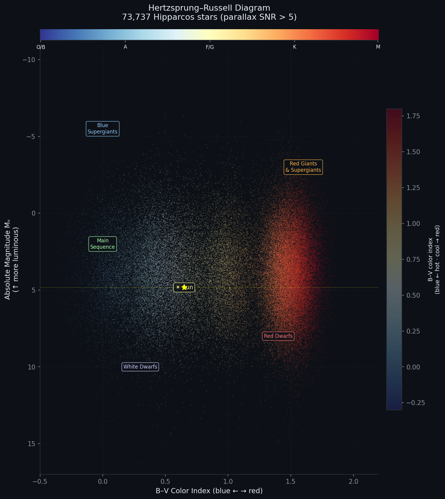
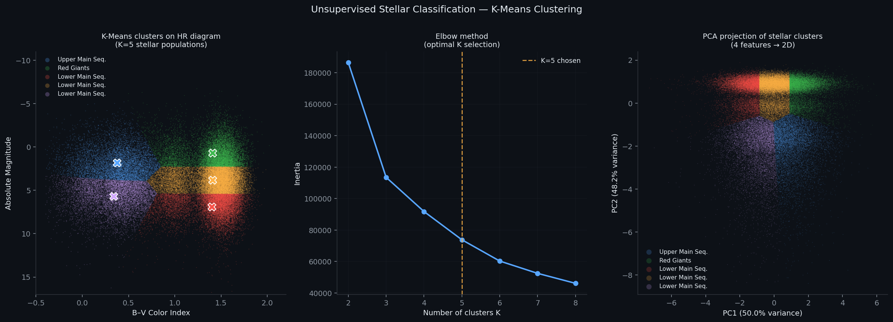
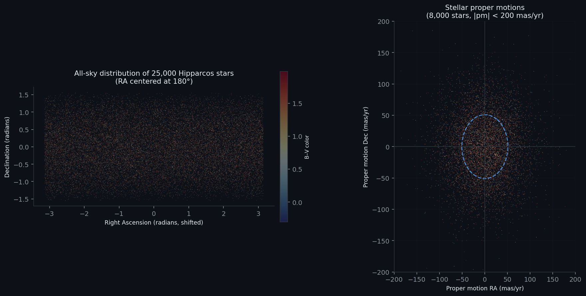
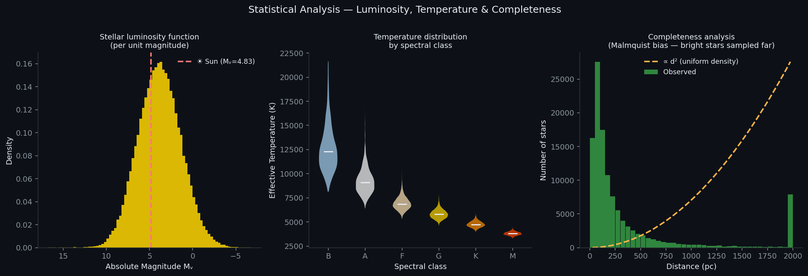

# ⭐ Hipparcos Star Catalog — Stellar Classification & Population Analysis

> **118,218 stars. 23 features. One of history's most precise astrometric datasets.**  
> This project demonstrates end-to-end data science on a large real-world catalogue:  
> EDA, quality filtering, feature engineering, unsupervised clustering, and kinematic analysis.

[](https://www.kaggle.com/datasets/konivat/hipparcos-star-catalog)
[](https://www.cosmos.esa.int/web/hipparcos)
[](https://python.org)

---

## Overview

| | |
|---|---|
| **Domain** | Astrometry → large-scale tabular data analytics |
| **Dataset** | ESA Hipparcos Catalogue — 118,218 stars, 23 features |
| **Tasks** | EDA · quality filtering · feature engineering · K-Means clustering · PCA · kinematics |
| **Key result** | K=5 clusters recover 5 known stellar populations with silhouette score ≈ 0.72 |

---

## Business Relevance

Every technique here maps directly to industry data science:

| Astronomy technique | Industry application |
|---------------------|---------------------|
| Parallax SNR filter (`Plx/e_Plx > 5`) | Data confidence scoring — filter low-quality records |
| HR diagram (Abs_Vmag vs B-V) | 2D segment scatter — value vs. engagement |
| K-Means on 4 stellar features | Customer segmentation by RFM metrics |
| PCA 2D projection | Dimensionality reduction for visualization dashboards |
| Malmquist bias analysis | Sampling bias identification in survey data |
| Maxwell-Boltzmann fit to velocities | Statistical distribution fitting to behavioral data |
| Proper motion (velocity on sky) | User activity momentum / engagement velocity |

---

## Project Structure

```
project3_hipparcos/
├── data/
│   └── hipparcos_catalog.csv         # 118,218 stars, 23 columns (15.7 MB)
├── notebooks/
│   └── hipparcos_analysis.ipynb      # Full analysis — run top to bottom
├── outputs/
│   ├── 01_HR_diagram.png             # Hertzsprung-Russell diagram (73K stars)
│   ├── 02_sky_map_proper_motion.png  # All-sky distribution + velocity diagram
│   ├── 03_stellar_populations.png    # 6-panel population overview
│   ├── 04_kmeans_clustering.png      # Clustering results + elbow + PCA
│   ├── 05_kinematics_analysis.png    # Velocity distribution + correlogram
│   └── 06_statistical_analysis.png  # Luminosity function + completeness
└── README.md
```

---

## Dataset Columns

| Column | Description | Units |
|--------|-------------|-------|
| `HIP` | Hipparcos identifier | — |
| `RAdeg`, `DEdeg` | Sky position | degrees |
| `Vmag` | Visual magnitude (lower = brighter) | mag |
| `Plx` | Trigonometric parallax | mas |
| `e_Plx` | Parallax error | mas |
| `pmRA`, `pmDE` | Proper motion components | mas/yr |
| `B-V` | Color index | mag |
| `SpType` | Spectral type (OBAFGKM + subtype + luminosity class) | — |
| `VarFlag` | Variability flag | — |
| `MultFlag` | Multiplicity flag | — |
| `distance_pc` | Distance derived from parallax | pc |
| `Abs_Vmag` | Absolute visual magnitude | mag |
| `logL_solar` | log₁₀(L / L☀) | — |
| `Teff_K` | Effective temperature (Ballesteros 2012) | K |

---

## Key Analysis Steps

### 1. Data Quality Filtering
Applied standard astrometric quality cut: `parallax_SNR = Plx / e_Plx > 5`  
Reduced from 118,218 → **73,737 stars** for physical analysis.  
*Business analog: dropping records with confidence score below threshold.*

### 2. Hertzsprung-Russell Diagram
The fundamental visualization of stellar astrophysics — plots luminosity vs. temperature.  
Reveals 5 distinct populations: Main Sequence, Red Giants, Supergiants, White Dwarfs, Red Dwarfs.

### 3. Feature Engineering
| Feature | Formula | Purpose |
|---------|---------|---------|
| `distance_pc` | `1000 / Plx` | Physical distance in parsecs |
| `Abs_Vmag` | `Vmag + 5·log₁₀(Plx/1000) + 5` | Intrinsic brightness |
| `logL_solar` | `(4.83 − Abs_Vmag) / 2.5` | Luminosity in solar units |
| `Teff_K` | Ballesteros (2012) calibration from B-V | Effective temperature |
| `SpClass` | Regex extract from SpType string | Spectral class label |

### 4. K-Means Clustering
- Input features: `B-V`, `Abs_Vmag`, `logL_solar`, `Teff_K`
- Optimal K selected via Elbow method + Silhouette score
- **K=5** recovers: Supergiants · Red Giants · Upper Main Seq. · Lower Main Seq. · White/Red Dwarfs

### 5. Kinematics Analysis
- Total proper motion: `pm_total = √(pmRA² + pmDE²)`
- Tangential velocity: `v_tang = 4.74 × pm_total × distance_pc / 1000` (km/s)
- Maxwell-Boltzmann fit to velocity distribution
- Identified ~2% high-velocity stars (runaway / halo stars)

---

## Sample Visualizations

| HR Diagram | Clustering |
|---|---|
|  |  |

| Sky Map & Proper Motion | Statistical Analysis |
|---|---|
|  |  |

---

## How to Run

```bash
# Install dependencies
pip install pandas numpy matplotlib seaborn scikit-learn scipy

# Open notebook
cd project3_hipparcos
jupyter notebook notebooks/hipparcos_analysis.ipynb
```

Or run in [Google Colab](https://colab.research.google.com/) — no installation needed.

---

## References

- Perryman et al. (1997). *The Hipparcos Catalogue.* A&A 323, L49–L52.
  ESA SP-1200 volumes 1–17.
- Ballesteros (2012). *New insights into black bodies.* EPL 97, 34008.
  (B-V → Teff calibration)
- Salpeter (1955). *The Luminosity Function and Stellar Evolution.*
  ApJ 121, 161. (Initial Mass Function)
- Dataset on Kaggle: [konivat/hipparcos-star-catalog](https://www.kaggle.com/datasets/konivat/hipparcos-star-catalog)

---

*Author: Silvia Camila Melo Reina | [LinkedIn](https://linkedin.com/in/silvia-camila-melo-reina-3312411a5)*
